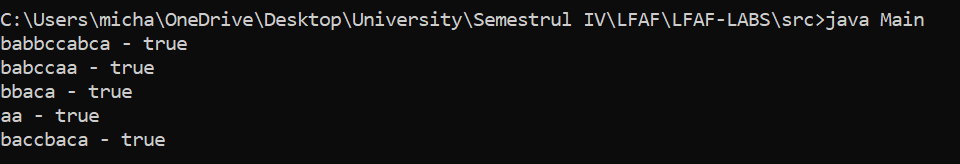

# LFAF LAB 1
### Course: Formal Languages & Finite Automata
### Author: Echim Mihail FAF 211
### Variant: 12
----

## Objectives:

1. Understand what a language is and what it needs to have in order to be considered a formal one.

2. Provide the initial setup for the evolving project that you will work on during this semester. I said project because usually at lab works, I encourage/impose students to treat all the labs like stages of development of a whole project. Basically you need to do the following:

    a. Create a local && remote repository of a VCS hosting service (let us all use Github to avoid unnecessary headaches);

    b. Choose a programming language, and my suggestion would be to choose one that supports all the main paradigms;

    c. Create a separate folder where you will be keeping the report. This semester I wish I won't see reports alongside source code files, fingers crossed;

3. According to your variant number (by universal convention it is register ID), get the grammar definition and do the following tasks:

    a. Implement a type/class for your grammar;

    b. Add one function that would generate 5 valid strings from the language expressed by your given grammar;

    c. Implement some functionality that would convert and object of type Grammar to one of type Finite Automaton;
    
    d. For the Finite Automaton, please add a method that checks if an input string can be obtained via the state transition from it;

## Implementation description

I have three classes: Main, Grammar and DFA.

* The Grammar class has a setRules() function that is called in the constructor. This function sets the rules according to my Variant in the form of a 2D Matrix of Strings

```
Grammar(){
        setRules();
    }

    private void setRules(){
        rules[0][0] = "S";
        rules[0][1] = "aF";
        rules[0][2] = "bS";
        // 
        rules[1][0] = "F";
        rules[1][1] = "bF";
        rules[1][2] = "cD";
        rules[1][3] = "a";
        // 
        rules[2][0] = "D";
        rules[2][1] = "cS";
        rules[2][2] = "a";
    }
```
* The Grammar class also has a function called generateString() that generates a String according to those rules. I implemented this iteratively, iterating through each letter of the word to cross reference it with the grammar matrix and randomly choose a rule when appropriate.
```
public String generateString(){
        String newString = "S";
        for (int k = 0; k < newString.length(); k++){
            for (int i = 0; i < 3; i++){
                if (newString.charAt(k) == rules[i][0].charAt(0)){
                    int count = 0;
                    // System.out.println("start: " +newString+ " : end");
                    for (int j = 1; j < 4; j++){
                        if (rules[i][j] != null){
                            count++;
                        }
                    }
                    newString = newString.substring(0, k) + rules[i][rand.nextInt(1, count+1)];
                }
            }        
        }

        return newString;
    }
```
* In the DFA class I only have one function called accepts(). It returns a boolean and gets a String as a parameter. 
* I defined the delta as a 2D matrix of integers which has dimensions Q x SIGMA, where Q is the number of states of the automaton and SIGMA is the size of the alphabet. I also added an accepting and error states. If an unwarranted input is provided in the wrong state, the automaton navigates to a error state to signify that the string is not accepted.
```
int[][] delta = {
            {1, 0, -1}, 
            {3, 1, 2}, 
            {3, -1, 0},
            {-1, -1, -1},  //accepting state
            {-1, -1, -1} //error state
        };
        int accepting_state = 3;

```

* Then I iteratively look through each letter and convert it to an integer input, checking if the input corresponds with the alphabet. Then, I check if the next state is an error state, in which case I do not accept the String. After that I change the state to the next one and so on in the loop, until it's done.
```
for (int i = 0; i < s.length(); i++) {
            char c = s.charAt(i);
            int input;
            if (c == 'a') {
                input = 0;
            } else if (c == 'b') {
                input = 1;
            } else if (c == 'c') {
                input = 2;
            } else {
                // Input symbol not in the alphabet
                return false;
            }
            int next_state = delta[current_state][input];
            if (next_state == -1) {
                // Entered error state
                return false;
            }
            current_state = next_state;
        }

        return current_state == accepting_state;
```

* In the Main class I have two methods: main and IsStringInArray() which does what it sounds like it would do. I use this function to generate an array of 5 distinct words using the grammar object.
```
public static boolean isStringInArray(String str, String[] arr) {
		for (String s : arr) {
			if (str.equals(s)) {
				return true;
			}
		}
		return false;
	}
```
* In the main function, I instantiate the Grammar and DFA classes, generate an array of 5 distinct words using the grammar object, check them with the dfa object and print the results on the screen.
```
public static void main(String[] args) {
		Grammar grammar = new Grammar();
		DFA dfa = new DFA();
		// grammar.printRules();
		String[] sarray = new String[5];

		for (int i = 0; i < 5; i++) {
			String newString = grammar.generateString();

			// Check if the new string is already in the array
			while (isStringInArray(newString, sarray)) {
				newString = grammar.generateString(); // Generate a new string
			}

			// Add the new string to the array
			sarray[i] = newString;
			System.out.println(sarray[i] + " - " + dfa.accepts(sarray[i]));
		}

	}
```
## Conclusions / Screenshots / Results
* This is an example of the program run



* While accomplishing this laboratory work, I understood the concepts of Formal Languages and Finite Automaton way better than I had before. It really forced me to implement these concepts and that made the understanding way deeper than it could ever be without such an experience.
